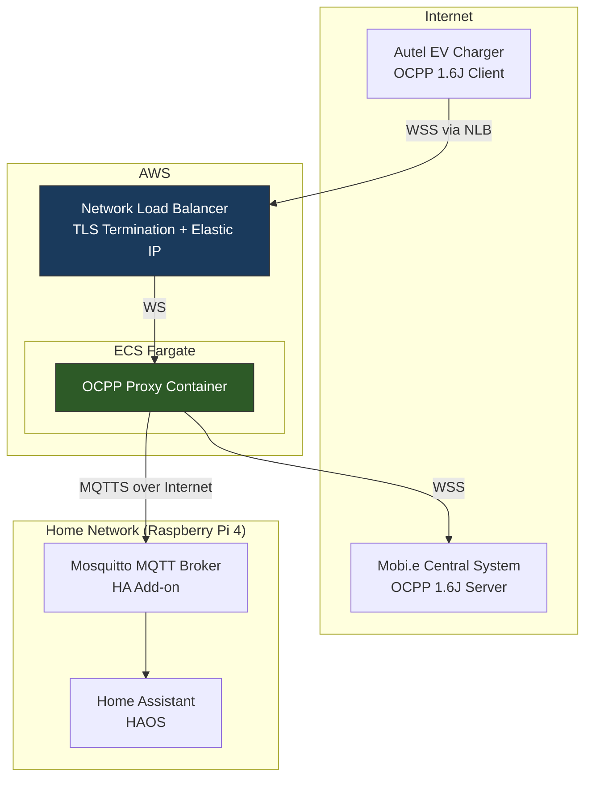
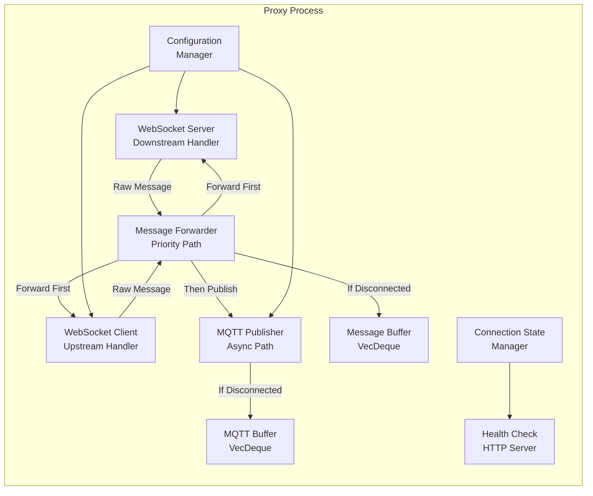
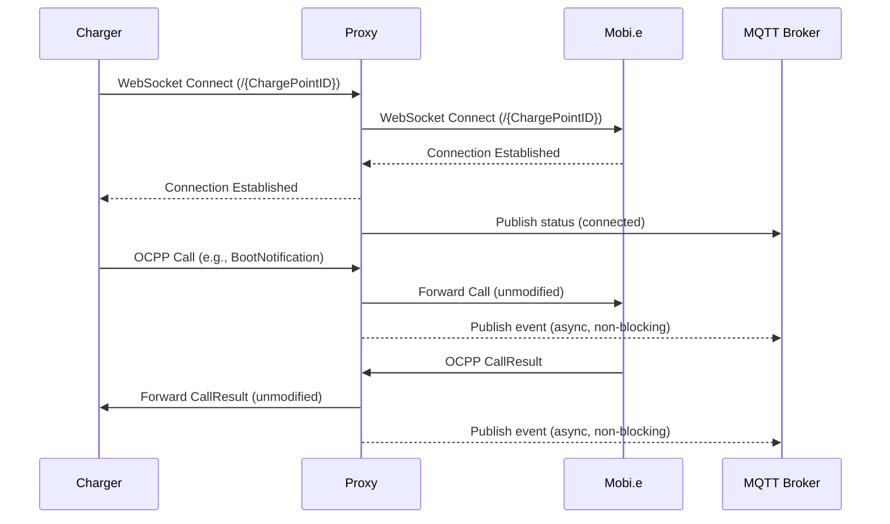
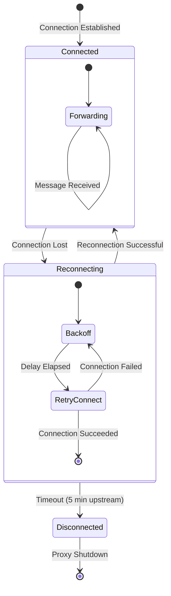

# Design Document: OCPP Proxy HA Integration

## Overview

This document describes the technical design for an OCPP 1.6J WebSocket proxy hosted on AWS that sits between an Autel EV charger and the Mobi.e Central System. The proxy transparently forwards all OCPP messages bidirectionally while capturing events and publishing them to an MQTT broker for Home Assistant integration on a local Raspberry Pi 4.

### Key Design Decisions

1. **Language: Rust** — Chosen for its zero-cost abstractions, memory safety without GC, and excellent async ecosystem. The proxy is a long-running, latency-sensitive process where Rust's performance characteristics and small binary/container size are ideal for cost-efficient AWS deployment.

2. **Async Runtime: Tokio** — The de facto standard for async Rust. Provides the executor, timers, I/O primitives, and channels needed for concurrent WebSocket and MQTT operations.

3. **WebSocket: tokio-tungstenite** — Mature, well-tested WebSocket library built on Tokio. Supports subprotocol negotiation, which is essential for OCPP 1.6J's `ocpp1.6` subprotocol requirement.

4. **HTTP Framework: axum** — Used for the health check endpoint and WebSocket upgrade handling. Axum integrates natively with Tokio and provides ergonomic routing with tower middleware support.

5. **MQTT: rumqttc** — Pure Rust async MQTT client backed by Tokio. Supports MQTT 3.1.1, QoS levels 0-2, TLS, Last Will and Testament, and automatic reconnection.

6. **Configuration: config + serde** — The `config` crate supports layered configuration (environment variables over YAML files), and `serde` provides zero-boilerplate deserialization.

7. **Deployment: Single-container on ECS Fargate** — Stateless design with a Network Load Balancer (NLB) fronting the WebSocket port. NLB is preferred over ALB for WebSocket connections due to its layer-4 nature and stable IP support via Elastic IP.

### Architecture Rationale

The proxy prioritizes Mobi.e communication above all else. MQTT publishing is entirely asynchronous and decoupled from the forwarding path. If the MQTT broker is unreachable, message forwarding continues unaffected. The proxy buffers MQTT messages internally and delivers them when connectivity is restored.

## Architecture



### Internal Component Architecture



### Message Flow Sequence



## Components and Interfaces

### 1. WebSocket Server (Downstream Handler)

**Responsibility:** Accept and manage the charger's incoming WebSocket connection.

**Interface:**
```rust
pub struct DownstreamHandler {
    listen_addr: SocketAddr,
    charge_point_id: Option<String>,
    connection: Option<WebSocketStream>,
    state: ConnectionState,
}

impl DownstreamHandler {
    /// Start listening for charger connections
    pub async fn start(&mut self) -> Result<(), ProxyError>;
    
    /// Accept a new WebSocket connection, closing any existing one
    pub async fn accept_connection(&mut self, stream: TcpStream) -> Result<(), ProxyError>;
    
    /// Receive the next message from the charger
    pub async fn recv(&mut self) -> Result<OcppFrame, ProxyError>;
    
    /// Send a message to the charger
    pub async fn send(&mut self, frame: OcppFrame) -> Result<(), ProxyError>;
    
    /// Close the connection gracefully
    pub async fn close(&mut self, code: CloseCode) -> Result<(), ProxyError>;
    
    /// Get current connection state
    pub fn state(&self) -> ConnectionState;
}
```

**Behavior:**
- Listens on configurable port, accepts connections at `/{Charge_Point_ID}`
- Validates `ocpp1.6` subprotocol during WebSocket upgrade
- Replaces existing connection if a new one arrives for the same Charge Point ID
- Emits connection state changes through a channel

### 2. WebSocket Client (Upstream Handler)

**Responsibility:** Maintain the connection to the Mobi.e Central System.

**Interface:**
```rust
pub struct UpstreamHandler {
    central_system_url: Url,
    charge_point_id: String,
    connection: Option<WebSocketStream>,
    state: ConnectionState,
    reconnect_strategy: ExponentialBackoff,
}

impl UpstreamHandler {
    /// Connect to the Central System
    pub async fn connect(&mut self) -> Result<(), ProxyError>;
    
    /// Receive the next message from the Central System
    pub async fn recv(&mut self) -> Result<OcppFrame, ProxyError>;
    
    /// Send a message to the Central System
    pub async fn send(&mut self, frame: OcppFrame) -> Result<(), ProxyError>;
    
    /// Close the connection gracefully
    pub async fn close(&mut self, code: CloseCode) -> Result<(), ProxyError>;
    
    /// Get current connection state
    pub fn state(&self) -> ConnectionState;
    
    /// Attempt reconnection with exponential backoff
    pub async fn reconnect(&mut self) -> Result<(), ProxyError>;
}
```

**Behavior:**
- Initiates upstream connection when charger connects
- Mirrors the Charge Point ID and subprotocol from the downstream connection
- Reconnects with exponential backoff (2s initial, 60s max) on disconnection
- Keeps downstream alive for up to 5 minutes during reconnection

### 3. Message Forwarder

**Responsibility:** Route messages between downstream and upstream, preserving order and payload integrity. This is the priority path.

**Interface:**
```rust
pub struct MessageForwarder {
    upstream_buffer: VecDeque<OcppFrame>,
    downstream_buffer: VecDeque<OcppFrame>,
    max_buffer_size: usize,
    max_buffer_duration: Duration,
    mqtt_tx: mpsc::Sender<MqttEvent>,
    call_tracker: CallTracker,
}

impl MessageForwarder {
    /// Forward a message from charger to central system
    pub async fn forward_upstream(
        &mut self,
        frame: OcppFrame,
        upstream: &mut UpstreamHandler,
    ) -> Result<(), ProxyError>;
    
    /// Forward a message from central system to charger
    pub async fn forward_downstream(
        &mut self,
        frame: OcppFrame,
        downstream: &mut DownstreamHandler,
    ) -> Result<(), ProxyError>;
    
    /// Flush buffered messages when connection is restored
    pub async fn flush_buffer(
        &mut self,
        direction: Direction,
        handler: &mut dyn WebSocketSink,
    ) -> Result<usize, ProxyError>;
}
```

**Behavior:**
- Forwards messages without modification (byte-for-byte preservation)
- Maintains FIFO order per direction
- Buffers up to 100 messages / 30 seconds when destination is disconnected
- Discards oldest messages when buffer limits are exceeded, logging each discard
- Sends a copy to the MQTT publisher channel after successful forwarding
- Tracks Call message IDs to correlate CallResult/CallError with their originating action

### 4. MQTT Publisher

**Responsibility:** Publish OCPP events to the MQTT broker asynchronously.

**Interface:**
```rust
pub struct MqttPublisher {
    client: AsyncClient,
    charge_point_id: String,
    event_rx: mpsc::Receiver<MqttEvent>,
    buffer: VecDeque<MqttMessage>,
    max_buffer_size: usize,
    state: ConnectionState,
}

impl MqttPublisher {
    /// Start the MQTT publisher event loop
    pub async fn run(&mut self) -> Result<(), ProxyError>;
    
    /// Publish an OCPP event to the appropriate topic
    async fn publish_event(&mut self, event: MqttEvent) -> Result<(), ProxyError>;
    
    /// Publish connection status update (retained)
    async fn publish_status(&mut self, status: ConnectionStatus) -> Result<(), ProxyError>;
    
    /// Flush buffered messages after reconnection
    async fn flush_buffer(&mut self) -> Result<usize, ProxyError>;
}
```

**Behavior:**
- Runs in a dedicated Tokio task, consuming events from an mpsc channel
- Publishes to `ocpp/{charge_point_id}/{direction}/{action}` topics
- Uses QoS 1 for at-least-once delivery
- Buffers up to 500 messages when broker is unreachable
- Publishes retained status messages on connection state changes
- Configures LWT for `ocpp/{charge_point_id}/availability` topic

### 5. Configuration Manager

**Responsibility:** Load and validate configuration from environment variables and YAML.

**Interface:**
```rust
pub struct ProxyConfig {
    pub central_system_url: Url,
    pub listen_port: u16,
    pub health_port: u16,
    pub mqtt: MqttConfig,
    pub logging: LogConfig,
    pub buffers: BufferConfig,
}

impl ProxyConfig {
    /// Load configuration from env vars and YAML file
    pub fn load() -> Result<Self, ConfigError>;
    
    /// Validate all configuration parameters
    pub fn validate(&self) -> Result<(), Vec<ConfigError>>;
}
```

### 6. Health Check Server

**Responsibility:** Expose HTTP health endpoint for AWS load balancer and monitoring.

**Interface:**
```rust
pub struct HealthServer {
    port: u16,
    state: Arc<SharedState>,
}

impl HealthServer {
    /// Start the health check HTTP server
    pub async fn run(&self) -> Result<(), ProxyError>;
    
    /// Compute current health status
    fn compute_health(&self) -> HealthResponse;
}
```

### 7. Connection State Manager

**Responsibility:** Track connection states and coordinate state transitions across components.

**Interface:**
```rust
pub struct ConnectionStateManager {
    upstream_state: ConnectionState,
    downstream_state: ConnectionState,
    mqtt_state: ConnectionState,
    state_tx: broadcast::Sender<StateChange>,
    metrics: ConnectionMetrics,
}

impl ConnectionStateManager {
    /// Update a connection's state and notify subscribers
    pub fn transition(&mut self, conn: ConnectionId, new_state: ConnectionState);
    
    /// Get overall proxy health status
    pub fn health_status(&self) -> HealthStatus;
    
    /// Subscribe to state change notifications
    pub fn subscribe(&self) -> broadcast::Receiver<StateChange>;
}
```

## Data Models

### OCPP Frame

```rust
/// Raw OCPP message frame - preserved byte-for-byte
#[derive(Debug, Clone)]
pub struct OcppFrame {
    /// The raw JSON text exactly as received (preserves field order, whitespace)
    pub raw: String,
    /// Parsed message type for routing and logging
    pub message_type: OcppMessageType,
    /// Unique message ID from the OCPP frame
    pub unique_id: String,
    /// Timestamp when the proxy received this frame
    pub received_at: DateTime<Utc>,
}

/// OCPP 1.6J message types
#[derive(Debug, Clone, PartialEq)]
pub enum OcppMessageType {
    /// [2, UniqueId, Action, Payload] - Request
    Call { action: String },
    /// [3, UniqueId, Payload] - Response
    CallResult,
    /// [4, UniqueId, ErrorCode, ErrorDescription, ErrorDetails] - Error
    CallError,
}

/// Direction of message flow
#[derive(Debug, Clone, Copy, PartialEq)]
pub enum Direction {
    /// Charger → Central System
    ChargerToCentral,
    /// Central System → Charger
    CentralToCharger,
}
```

### Call Tracker

```rust
/// Tracks in-flight Call messages to correlate CallResult/CallError with their action
#[derive(Debug)]
pub struct CallTracker {
    /// Maps UniqueId → (Action, Direction, Timestamp)
    pending_calls: HashMap<String, PendingCall>,
    /// Maximum age before entries are evicted
    max_age: Duration,
}

#[derive(Debug, Clone)]
pub struct PendingCall {
    pub action: String,
    pub direction: Direction,
    pub sent_at: DateTime<Utc>,
}
```

### MQTT Event

```rust
/// Event sent to the MQTT publisher task
#[derive(Debug, Clone)]
pub enum MqttEvent {
    /// An OCPP message was forwarded
    MessageForwarded {
        frame: OcppFrame,
        direction: Direction,
        /// Resolved action name (for CallResult/CallError, this is the originating Call's action)
        action: String,
    },
    /// Connection state changed
    StateChange {
        upstream: ConnectionState,
        downstream: ConnectionState,
    },
}

/// MQTT message payload published to the broker
#[derive(Debug, Clone, Serialize)]
pub struct MqttPayload {
    pub timestamp: String,       // ISO 8601
    pub message_type: String,    // "Call", "CallResult", "CallError"
    pub payload: serde_json::Value,
}
```

### Connection State

```rust
/// Connection lifecycle states
#[derive(Debug, Clone, Copy, PartialEq, Serialize)]
#[serde(rename_all = "snake_case")]
pub enum ConnectionState {
    Disconnected,
    Connecting,
    Connected,
    Reconnecting,
}

/// State change event
#[derive(Debug, Clone)]
pub struct StateChange {
    pub connection: ConnectionId,
    pub previous: ConnectionState,
    pub current: ConnectionState,
    pub timestamp: DateTime<Utc>,
}

#[derive(Debug, Clone, Copy, PartialEq)]
pub enum ConnectionId {
    Upstream,
    Downstream,
    Mqtt,
}
```

### Configuration

```rust
#[derive(Debug, Clone, Deserialize)]
pub struct ProxyConfig {
    pub central_system_url: String,
    pub listen_port: u16,
    #[serde(default = "default_health_port")]
    pub health_port: u16,
    pub mqtt: MqttConfig,
    #[serde(default)]
    pub logging: LogConfig,
    #[serde(default)]
    pub buffers: BufferConfig,
}

#[derive(Debug, Clone, Deserialize)]
pub struct MqttConfig {
    pub host: String,
    pub port: u16,
    pub username: String,
    pub password: String,
    pub ca_cert_path: String,
    pub client_cert_path: String,
    pub client_key_path: String,
}

#[derive(Debug, Clone, Deserialize)]
pub struct LogConfig {
    #[serde(default = "default_log_level")]
    pub level: LogLevel,
}

#[derive(Debug, Clone, Deserialize)]
pub struct BufferConfig {
    #[serde(default = "default_message_buffer")]
    pub message_buffer_size: usize,   // default: 100
    #[serde(default = "default_mqtt_buffer")]
    pub mqtt_buffer_size: usize,      // default: 500
    #[serde(default = "default_max_backoff")]
    pub max_backoff_seconds: u64,     // default: 60
}
```

### Health Response

```rust
#[derive(Debug, Serialize)]
pub struct HealthResponse {
    pub status: HealthStatus,
    pub upstream: ConnectionState,
    pub downstream: ConnectionState,
    pub mqtt: ConnectionState,
    pub uptime_seconds: u64,
    pub messages: MessageCounters,
}

#[derive(Debug, Serialize)]
pub struct MessageCounters {
    pub charger_to_central_forwarded: u64,
    pub charger_to_central_dropped: u64,
    pub central_to_charger_forwarded: u64,
    pub central_to_charger_dropped: u64,
}

#[derive(Debug, Clone, Copy, Serialize, PartialEq)]
#[serde(rename_all = "snake_case")]
pub enum HealthStatus {
    Healthy,
    Degraded,
    Unhealthy,
}
```

### Exponential Backoff

```rust
#[derive(Debug, Clone)]
pub struct ExponentialBackoff {
    pub initial: Duration,
    pub max: Duration,
    pub current: Duration,
    pub multiplier: f64,  // default: 2.0
}

impl ExponentialBackoff {
    pub fn next_delay(&mut self) -> Duration;
    pub fn reset(&mut self);
}
```


## Correctness Properties

*A property is a characteristic or behavior that should hold true across all valid executions of a system — essentially, a formal statement about what the system should do. Properties serve as the bridge between human-readable specifications and machine-verifiable correctness guarantees.*

### Property 1: Message forwarding preserves payload byte-for-byte

*For any* valid OCPP JSON message (Call, CallResult, or CallError) and *for any* direction (charger-to-central or central-to-charger), the forwarded message SHALL be byte-for-byte identical to the received message, preserving field order, whitespace, and all characters.

**Validates: Requirements 3.1, 3.2, 3.3**

### Property 2: Message ordering is preserved per direction

*For any* sequence of OCPP messages received on a single direction of the connection, the forwarded messages SHALL appear in the exact same order as they were received.

**Validates: Requirements 3.4**

### Property 3: Message buffer respects capacity and eviction policy

*For any* sequence of messages arriving while the destination is disconnected, the buffer SHALL never contain more than `max_buffer_size` messages (default 100), and when the buffer is full, the oldest message SHALL be evicted first (FIFO eviction).

**Validates: Requirements 3.5, 4.5**

### Property 4: Exponential backoff computes correct delays

*For any* exponential backoff configuration (initial delay, multiplier, maximum delay) and *for any* number of retry attempts, the computed delay for attempt N SHALL equal min(initial × multiplier^(N-1), maximum), and the delay SHALL never exceed the configured maximum.

**Validates: Requirements 2.4, 6.3**

### Property 5: MQTT topic construction follows the format specification

*For any* valid Charge_Point_ID, *for any* direction (charger or central_system), and *for any* OCPP action name, the constructed MQTT topic SHALL equal `ocpp/{Charge_Point_ID}/{direction}/{action}` with no additional path segments, leading/trailing slashes, or character transformations.

**Validates: Requirements 5.2**

### Property 6: MQTT payload contains all required fields with correct types

*For any* OCPP message forwarded by the proxy, the published MQTT JSON payload SHALL contain: a `timestamp` field that is a valid ISO 8601 string, a `message_type` field that is one of "Call", "CallResult", or "CallError", and a `payload` field containing the full original OCPP message JSON array.

**Validates: Requirements 5.3**

### Property 7: MQTT buffer respects capacity and eviction policy

*For any* sequence of MQTT events generated while the MQTT broker is unreachable, the MQTT buffer SHALL never contain more than 500 messages, and when the buffer is full, the oldest message SHALL be evicted first (FIFO eviction).

**Validates: Requirements 5.5**

### Property 8: Connection status message reflects actual states

*For any* combination of upstream connection state (connected, disconnected, reconnecting) and downstream connection state (connected, disconnected, reconnecting), the published status JSON on `ocpp/{Charge_Point_ID}/status` SHALL accurately represent both connection states.

**Validates: Requirements 5.6**

### Property 9: Health status computation is correct for all state combinations

*For any* combination of upstream, downstream, and MQTT connection states: IF downstream is disconnected THEN status SHALL be `unhealthy` (503); ELSE IF upstream and downstream are both connected and MQTT is disconnected THEN status SHALL be `degraded` (200); ELSE IF upstream and downstream are both connected THEN status SHALL be `healthy` (200); ELSE status SHALL be `unhealthy` (503).

**Validates: Requirements 10.3, 10.4, 10.5, 10.6**

### Property 10: Configuration validation rejects all invalid inputs

*For any* port number outside range 1–65535, *for any* URL not matching ws:// or wss:// scheme, *for any* file path that does not exist or is not readable, and *for any* log level not in {DEBUG, INFO, WARNING, ERROR}, the configuration validator SHALL reject the value and report it as invalid.

**Validates: Requirements 7.5**

### Property 11: Environment variables take precedence over YAML configuration

*For any* configuration parameter that appears in both an environment variable and the YAML file, the value from the environment variable SHALL be used, and the YAML value SHALL be ignored.

**Validates: Requirements 7.1**

### Property 12: All missing required parameters are reported together

*For any* non-empty subset of required configuration parameters that are absent, the startup error output SHALL list every missing parameter from that subset in a single error message.

**Validates: Requirements 7.2, 7.3**

### Property 13: New connections replace existing connections for the same Charge Point ID

*For any* sequence of connection attempts from chargers with the same Charge_Point_ID, only the most recently accepted connection SHALL be active, and all previously active connections for that ID SHALL have received a WebSocket close frame.

**Validates: Requirements 1.4**

### Property 14: Non-ocpp1.6 subprotocols are rejected

*For any* WebSocket subprotocol string that is not exactly `ocpp1.6`, the proxy SHALL reject the connection.

**Validates: Requirements 1.6**

### Property 15: All log entries are valid structured JSON with required fields

*For any* log event emitted by the proxy, the output SHALL be valid JSON containing at minimum: `timestamp` (ISO 8601), `level` (one of DEBUG/INFO/WARNING/ERROR), `component` (non-empty string), `message` (non-empty string), and `correlation_id` (non-empty string).

**Validates: Requirements 8.5**

### Property 16: Health response contains all required fields

*For any* health check request, the response JSON SHALL contain: `status` (healthy/degraded/unhealthy), `upstream` (connection state), `downstream` (connection state), `mqtt` (connection state), `uptime_seconds` (non-negative integer), and `messages` (object with four counter fields, all non-negative).

**Validates: Requirements 10.2**

### Property 17: Charge Point ID is preserved in upstream connection URL

*For any* valid Charge_Point_ID received in the downstream connection URL path, the upstream connection SHALL use a URL containing the same Charge_Point_ID in its path.

**Validates: Requirements 2.2**

## Error Handling

### Error Categories

| Category | Description | Recovery Strategy |
|----------|-------------|-------------------|
| `connection_downstream` | Charger WebSocket errors | Log and wait for charger to reconnect |
| `connection_upstream` | Mobi.e WebSocket errors | Exponential backoff reconnection (2s–60s) |
| `connection_mqtt` | MQTT broker errors | Exponential backoff reconnection (1s–30s), buffer messages |
| `forwarding` | Message delivery failures | Buffer if destination disconnecting, discard if buffer full |
| `config` | Configuration errors | Fail fast at startup with all errors reported |
| `protocol` | Invalid OCPP frames | Log at ERROR, drop the invalid frame, do not forward |
| `tls` | TLS handshake or cert errors | Log at ERROR, retry connection |

### Error Handling Principles

1. **Never disrupt Mobi.e communication** — Errors in MQTT, logging, or internal processing must never cause message forwarding to fail or be delayed.

2. **Fail fast at startup** — Configuration errors and missing certificates cause immediate startup failure with clear error messages listing all issues.

3. **Graceful degradation at runtime** — MQTT unavailability degrades monitoring but never affects core proxy functionality. The proxy transitions to "degraded" health status.

4. **Bounded resource usage** — All buffers have hard capacity limits. When limits are reached, oldest entries are evicted with warning logs. The proxy never accumulates unbounded memory.

5. **Structured error context** — Every error log includes: timestamp, error category, connection identifier, message unique ID (if applicable), and human-readable description. No stack traces or internal paths in any output.

### Connection Loss Scenarios



### MQTT Failure Handling

When the MQTT broker becomes unreachable:
1. Messages continue to be forwarded between charger and Mobi.e without delay
2. MQTT events are buffered in memory (up to 500 messages, FIFO)
3. Health status transitions to `degraded`
4. Reconnection attempts use exponential backoff (1s initial, 30s max)
5. When connectivity is restored, buffered messages are published in order
6. If buffer capacity is exceeded, oldest messages are discarded with WARNING logs

### Graceful Shutdown Sequence

1. Receive SIGTERM/SIGINT
2. Stop accepting new WebSocket connections
3. Complete forwarding of in-flight messages (up to 10 seconds)
4. Send WebSocket close frame (code 1000) to both charger and Mobi.e
5. Wait up to 5 seconds for close acknowledgments
6. Publish offline status to MQTT (if connected)
7. Disconnect MQTT client
8. Log shutdown completion with count of any discarded messages
9. Exit with code 0

## Testing Strategy

### Property-Based Testing

**Library:** [proptest](https://crates.io/crates/proptest) — Rust's most mature property-based testing framework, inspired by Hypothesis. Supports custom generators, shrinking, and persistence of failing cases.

**Configuration:**
- Minimum 100 test cases per property (configurable via `PROPTEST_CASES` env var)
- Each property test tagged with: `Feature: ocpp-proxy-ha-integration, Property {N}: {title}`

**Properties to implement as PBT:**

| Property | Generator Strategy |
|----------|-------------------|
| 1: Byte preservation | Generate random JSON arrays matching OCPP frame structure with varied whitespace, unicode, nested objects |
| 2: Ordering | Generate random-length Vec of OCPP frames, forward in order, verify output order |
| 3: Buffer eviction | Generate message counts from 1 to 500, verify buffer invariants |
| 4: Backoff computation | Generate (initial, multiplier, max, attempts) tuples, verify delay sequence |
| 5: Topic construction | Generate random alphanumeric Charge_Point_IDs, directions, actions |
| 6: Payload structure | Generate random OCPP messages of all 3 types, verify payload JSON structure |
| 7: MQTT buffer eviction | Generate event counts from 1 to 2000, verify buffer invariants |
| 8: Status message | Generate all 9 combinations of (upstream, downstream) × 3 states |
| 9: Health computation | Generate all 27 combinations of (upstream, downstream, mqtt) × 3 states |
| 10: Config validation | Generate valid and invalid values for each config parameter type |
| 11: Config precedence | Generate random key-value pairs in both env and YAML, verify env wins |
| 12: Missing params | Generate random subsets of required params to remove, verify error reports all |
| 13: Connection replacement | Generate sequences of 1-10 connection events for same ID |
| 14: Subprotocol rejection | Generate random strings that are not "ocpp1.6" |
| 15: Log format | Generate random log events, verify JSON structure |
| 16: Health response | Generate random state combinations and counter values |
| 17: Charge Point ID | Generate random valid IDs, verify preservation |

### Unit Tests (Example-Based)

Focus on specific scenarios and edge cases:
- OCPP frame parsing for each message type (Call, CallResult, CallError)
- Default configuration values when optional params are omitted
- LWT configuration verification
- WebSocket subprotocol negotiation with `ocpp1.6`
- Startup log format and content
- Buffer flush after reconnection
- Downstream disconnect clears central-to-charger buffer

### Integration Tests

- End-to-end message flow: charger → proxy → Mobi.e → proxy → charger
- MQTT broker disconnect and reconnect with buffered message delivery
- Upstream disconnect with charger buffering and replay
- Graceful shutdown under load
- Health endpoint responses during various failure modes
- TLS connection to MQTT broker with certificate verification
- Container startup time under 30 seconds

### Test Infrastructure

- **Mock WebSocket server** — Simulates Mobi.e Central System for integration tests
- **Mock MQTT broker** — Local Mosquitto instance in Docker for integration tests
- **Testcontainers** — For Docker-based integration test environments
- **Tokio test runtime** — `#[tokio::test]` for all async tests with configurable timeouts
